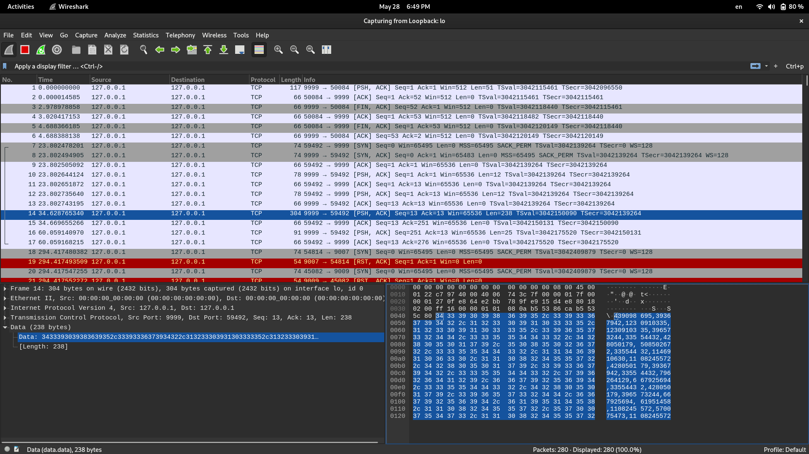
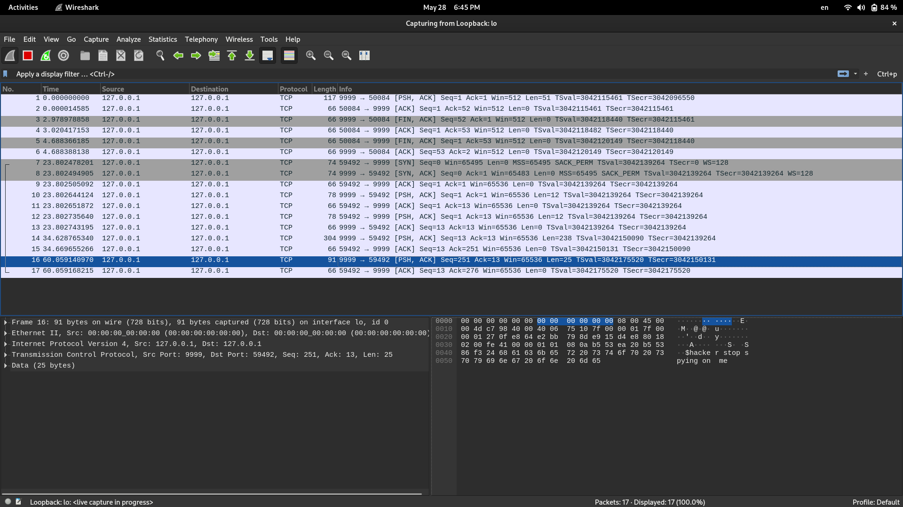

# RSA Algorithm Implementation and Communication Demo

This repository contains an implementation of the RSA (Rivest-Shamir-Adleman) algorithm from scratch. It also includes a demonstration of how the algorithm works by building two clients that communicate with each other through a channel. Additionally, the repository provides an analysis of the packets sent over the channel, attempting to break the private key using prime factorization.

## RSA Algorithm Implementation

The RSA algorithm is a widely used public-key encryption scheme that relies on the difficulty of prime factorization to ensure security. The implementation in this repository showcases the key components of the RSA algorithm, including key generation, encryption, and decryption. The code is written from scratch to provide a better understanding of the algorithm's inner workings.

## Communication Demo

The communication demonstration in this repository showcases how two clients can securely exchange messages using the RSA algorithm. The demo utilizes the RSA encryption and decryption functions implemented in the repository. The clients communicate through a channel, simulating a real-world scenario.

## Packet Analysis and Breaking the Private Key

To demonstrate the vulnerabilities of RSA, the `factorization.ipynb` provides a documentation of the process of factorizing the puplic key to generate the private key by analyzing the packets sent over the communication channel and attempts to break the private key by employing prime factorization techniques. It provides insights into the security weaknesses of RSA and serves as an educational tool to understand the importance of key length and prime number selection.

### The hacking process 

#### Clients Exchange public keys and massages

- first the clients exhange the puplic key to be able to encrypt massages in a way that only the one who have the private key associeted with this public key can understand.

- After exhachanging puplic keys the start sending massages to each other each encrypt the massage with the other's puplic key 

- one can sniff to the channel they sending the massages through and analyze the packets
    - encrypted massage

    - not encrypted massage: NOTE I tweeked the code if "$hacker" exists in the massage don't encrypt
